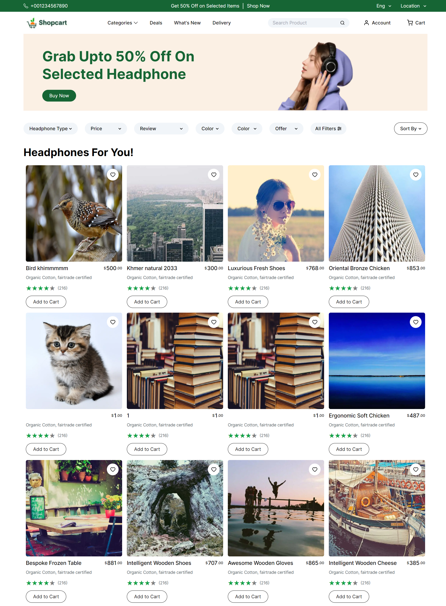
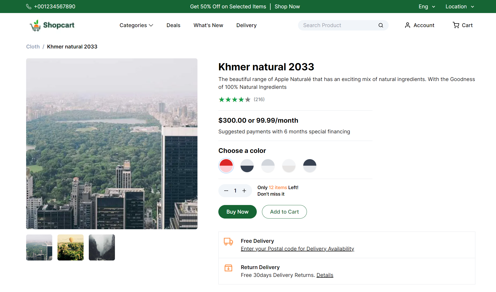

# Shopcart

It is a simple UI designed using the mockup UI provided for assessment. I used the Platzi Fake Store API to get demo products and display them in the UI. I have two pages (the product listing page and the product details page).

- Live: [https://shopcart-brown.vercel.app/](https://shopcart-brown.vercel.app/)
- Technologies Used: Next.Js 13 (App Dir), Tailwind CSS
- Mock API used: Platzi Fake Store API

## Steps to Run

```bash
git clone https://github.com/ajfuturistics/shopcart.git

cd shopcart

npm install

npm run dev
```

# Screenshots

### Product Listing Page



### Product Page


